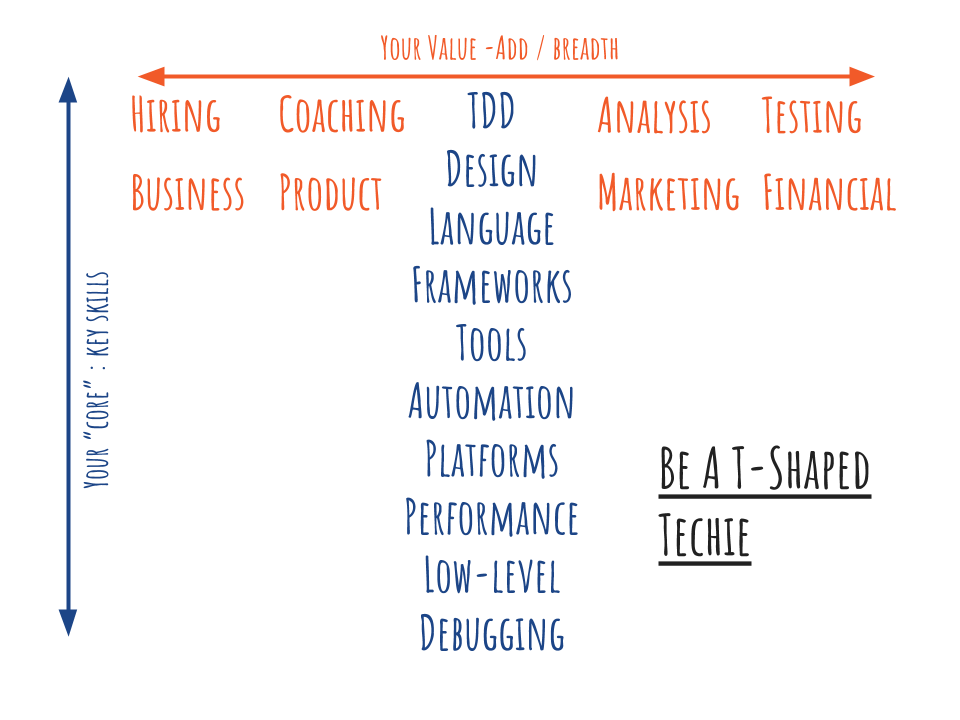

## Why screen candidates

We'd love to see all candidates face to face. We'd love to have a
complete view of their background, character and ability before making
a hiring decision. In practice, it's almost impossible for
organisations to commit this sort of time.

More importantly, we don't want to take up the candidate's time if we
think it's unlikely we're going to hire them. They're busy people
too. They're generally in employment, and if they're in Job Hunt Mode
then they'll often have multiple job applications live at any given
time.

Done right, screening gives you and the candidate a way of building
confidence in each other - as your investment in each other grows, so
does your confidence.

I want to emphasise that this needs to be a **matched investment**. At
**every stage**, the candidate needs to feel they know more about you,
in the same way you know more about them. If this investment becomes
unbalanced, then trust is eroded, and however appealing your job
advert was, you're back to sending a signal that this is really just
about your company and its requirements.

Also remember that screening is supposed to be quick, focused, and
relatively low&#8209;investment. I talk to experienced developers who
find the process that companies put in place time&#8209;consuming and
and burdensome. In some cases they'll make a choice to go with
companies who have a simpler and faster selection process.

This is not because they're lazy people, but because they're *busy*
people. In&#8209;demand developers will simply not have the time for
your 6&#8209;stage interview process spread over three months. You
need to keep it efficient - hire people with confidence, but don't
test their patience and make them look elsewhere. You can keep loading
on more tests and assessments, but you'll just have fewer people
engaged. You won't get to the finish line with the best candidates,
you get there *with the ones that are left*.

You have a finite amount of time with a candidate, so make it
count. Use the *right* screening and interviewing approaches, not
just *more*.

## T&#8209;shapes and technical specifics

A theme that's going to be running through this and the next article
is that we should look for breadth. This "T&#8209;shaped" model of
personal and professional development is often used to illustrate the
point. The thinking behind this is that you have a set of core skills
forming the stem of the T. The idea is that you continue to develop
those deep, core skills, but you also develop broad skills and
knowledge of other disciplines - the cross of the T.



Now, it's just a model, and a way of thinking about professional
development, but it does ring true for me. Before I even knew this
existed, whenever I was asked what the difference was between a
beginner developer and a proficient, experienced developer, someone
who worked really effectively in a team, I'd always reply "breadth and
depth", and I'll be returning to that phrase in a minute.

**You want T-shaped people**. Even if they don't always exercise that
breadth, the knowledge they have of other disciplines means they can
empathise and communicate well with a wide range of people.

That said, I understand how specific your requirements might be, and
how complex a technical domain some of you might be working in. It's
possible that you're hiring specific tech skills that can't easily be
picked up, or you're looking for a depth of experience to help mentor
newer developers.

For most of the next two posts, I'm going to have to make some
assumptions. With the infinite variety of technical backgrounds that
might be important to you, I don't want to be constantly issuing
caveats.

So, here's my assumption : if you're hiring experienced developers
with a specific skill&#8209;set, I'll assume you're smart people, that
you know about the technical domain you're hiring for, and that you
can apply good judgement as to whether the candidate has the right
experience or not. We'll look at the broader picture in these posts.

## And you, Technical Manager...do you code?

If you're not hands&#8209;on with development, you need to be
hands&#8209;off with developer hiring. Non&#8209;developers just
aren't in a position to assess developer skills, and their uncertainty
and lack of confidence in code will mean they'll focus on other
traits. Most likely they'll focus on the *wrong* traits.

This isn't about technical elitism, it's about engagement : the way we
hire people now needs participation from the interviewer, not just
observation. So, it doesn't matter that you *used* to code - everybody
*used* to code - what matters is whether you code *now*. The easiest
way to check is to do the online test, the assignment, or the live
interview challenge yourself.

If it's a struggle for you, it's time to take a step back and let
others participate, and make the call when it comes to the hiring
decision. Hopefully you've heeded my advice and got as many people in
your team involved in technical interviewing as you can.

## CV and cover letter

For each candidate, there's only one question that needs answered at
this stage : "Can I picture this person working as part of our team,
in this role?". That's it. I try to blot the rest of the selection
process out of my mind - it's a simple, standalone decision about a
single candidate.

If the answer is "yes", or "maybe", I'll have a phone conversation. If
the answer is "no", or "it's really unlikely" then the best thing for
the candidate is to give them as much feedback as you can, and let
them concentrate on their other job applications.

If you have hard requirements on experience level, depth, or breadth
of technical experience, you should be able to judge this quite easily
if you're working in the same technical domain. Putting aside your
technical specifics, here are some things I view as strong positives
in a CV, that would make me want to know more about a candidate:

- **Breadth and depth** : breadth is a multiplier - people with
  breadth add capability to teams far beyond their core skills. If
  you're hiring developers, look for signs of interest in other
  disciplines - test automation, product design, accessibility, broad
  industry knowledge - anything.

- **Self&#8209;improving** : evidence of personal or open&#8209;source
  projects is great, as well as attendance at any local meetups or
  conferences. I like to see people who are engaged in a wider
  technical community, although I have some important caveats on this
  later. Initiatives, experiments and innovation that people do on the
  job are things I always see as signs of self&#8209;improvement too.

- **Coaches** : I'm reassured when I see some signs that this person
  helps other people, because it gives me a good sense of how someone
  is going to work in a team. This can start in the earliest stages of
  a career, too, it's not something just for more experienced
  developers. Any signs that people are keen to share their knowledge
  and expertise - at whatever level - are attributes to look out for.

- **Ethical developers** : you want to hire developers who care about
  their users, customers, and colleagues. If I see some indications
  that developers are motivated by making things better for people,
  this makes me happy. This could be adoption of better
  test&#8209;driven approaches to get the product right for users or
  more secure code to protect them, more efficient code to improve
  battery life on a user's device, or improving readability and
  clarity of code for their colleagues.

- **Action&#8209;oriented** : it's something of a Silicon Valley term,
  but it's widely applicable in tech as a desirable trait. You want
  people who are going to do things, measure how they work, learn, and
  adapt. Some of this will be shaped by the way their organisation
  works, but still look for evidence that people run spikes,
  experiments and proofs&#8209;of&#8209;concept, and adapt their
  approach.

## Personal projects and meetups : a note of caution

Although it's great to see evidence of personal projects on GitHub or
elsewhere, remember that this can be a lot easier for some people than
others.

It's important to gauge this from a diversity standpoint. People with
a lot of discretionary time can work on personal projects, make open
source contributions, and attend meetups and conferences. However,
people with childcare or eldercare commitments often can't, and these
commitments tend to fall disproportionately on women. Also remember
that some technical communities are far less inclusive than others,
and it would be egregious to penalise women engineers for the
exclusionary behaviour of others.

In those cases where candidates do have these projects and activities,
sure, view them as positives, but always remember that personal
circumstances play a part. And if you're a cisgender, straight, white,
male technical manager, understand that your experience and perception
of tech communities are likely to be different from those of women,
LGBTQ+ and non&#8209;binary folk, and people of colour who work in
that same technical field.

Treat personal projects and tech community involvement as "more
information about candidate \<a>", and not "this makes candidate \<a>
a better prospect than candidate \<b>".

## Phone screens

Phone screens used to be quite the big thing: *Technical Interview
Lite*, effectively. Typically these would be short calls, and you'd be
armed with a set of technical questions. These questions were supposed
to be sure-fire ways of choosing the best candidates to go forward to
the next stage.

I've used them that way in the past, in Q&A mode, but always found
them stilted, awkward and ineffective, and I think candidates did
too. It's a strange sort of conversation, barking questions into a
mouthpiece apropos of nothing. Good candidates blank and stumble over
answers when they don't have context. Other candidates will have
memorised every Google search result for "technical interview phone
screen questions", and wing it, sometimes convincingly.

I still think there are merits to phone, Skype or Hangouts contact
though. It's a chance to check in with the candidate, let them know
there are actual human beings involved on your side of the process,
and that they're regular developers too. They also give the candidate
a chance to ask questions about the company, your technology, culture
and teams. _A matched investment_.

Although I still value phone screens, I do these very differently
now. I use a much more conversational style, and tend to base
questions around a candidate's experience, on what they *say they
know* rather than what we *think we need*. The value in these is a
consistency check, looking at experience and sense-checking against
what technical knowledge we can assess non-awkwardly over a phone.

With this approach, you follow the trail of the discussion, and spot
opportunities to ask some technical questions along the way. It's more
natural, tends to flow better, and you get a more accurate impression
of the candidate to base decisions on. What I'm looking for at this
stage is consistency rather than probing for very deep knowledge and
experience. The knack to this is to make the segue from general
discussion about past experience into more technical discussion as
unforced as possible, using the cues the candidate themselves give
you.

This is a much harder format for the interviewer to run than having a
set question list - for one thing, you need to have good
conversational skills yourself, and you also need to be able to show
the same genuine enthusiasm and interest you're expecting the
candidate to show. It needs you to think on your feet, but I think you
get a better feel for the candidate, and non sequitur technical
questions are just plain awkward.

Do these calls in pairs to give a balanced view. Remember from the
first post the point about diversity in your pool of interviewers?
Well, like any contact with the candidate, this is a point in the
process where diversity of opinion matters, and give thought to who
should primarily lead the conversation, and who should primarily
listen.

One specific behaviour to be a little wary of is hyper-confidence by
the candidate. You're looking to hire self-aware, reflective people
who learn as they go. A career presented by the candidate as an
unbroken series of ever more glorious successes makes me very nervous,
because I work in software development too and have a decent
understanding of what the reality looks like. It may be nerves on
their part, or it may be something else entirely.

## Assessing the phone screen

When you get to the end of the screen, and discuss with your
co-interviewer, focus your discussion around these points:

- "We talked to this candidate because we could picture them working
  with us. Is that still the case after speaking with them? More so,
  or less so?"

- "Did everything seem consistent? Did the narrative we got from the
  candidate correspond to what we read on the CV? When we asked
  technical questions, did the answers seem consistent with the
  experience that was being described? Were there any obvious gaps?
  Were there answers that were obviously wrong?"

- "Did the candidate seem comfortable talking about the work they'd
  done, or did they hesitate? Did they try and steer the conversation
  away from detail and technical questions?

- "Did we get a sense of enthusiasm and excitement about the technical
  domain, and also the role and our company?"

- "And finally, allowing for the candidate being nervous, would we
  change our view on any of these points above?

And make your decision like this : "Based on what we now know about
this candidate, do we now think it's more likely or less likely that
we'd hire them?"

## Online technical test platforms

Online technical assessment tools like
[HackerRank](https://www.hackerrank.com/) and
[Codility](https://codility.com/) are becoming more widespread in
hiring. I understand why companies are using them, although I think
they're used either wrongly or excessively more often than not. If you
haven't used these tools, here's a potted summary:

- The technical interviewer designs the test by picking from a list of
  coding challenges and questions.

- The candidate is sent a link to the online test, and works though
  it, with a countdown timer running, to complete the challenge.

- The screening tool tests correctness of the implementation using a
  variety of data sets and edge cases - an array with no elements, an
  array with one element, an array with all zeros, an array with large
  values that could overflow a accumulator variable....you get the
  picture.

- The screening tool assesses the efficiency of the implementation by
  pushing through data sets of increasing size in succession, timing
  these, and calculating the Big-O complexity of the candidate's
  solution.

- Candidates lose marks down for missing edge cases, and for
  implementing with less efficiency than is possible.

These platforms seem to provide an objective measure of capability, to
differentiate between candidates. After all, the intent of HackerRank
is to Rank your Hackers, is it not?

I see this all the time in software development - and not just in
hiring - this urge to reduce something complex, nuanced and difficult
to understand down to a dashboard metric. Numbers and measures are
seductive, especially to non-technical managers. They promise simple
answers and absolute truths.

Often, though, the way these tools are used is an example of the
Streetlight Effect [Source -
Wikipedia](https://en.wikipedia.org/wiki/Streetlight_effect):

> A policeman sees a drunk man searching for something under a
> streetlight and asks what the drunk has lost. He says he lost his
> keys and they both look under the streetlight together. After a few
> minutes the policeman asks if he is sure he lost them here, and the
> drunk replies, no, and that he lost them in the park. The policeman
> asks why he is searching here, and the drunk replies, "this is where
> the light is."

Just because there's light to see by, it doesn't mean you're looking
in the right place. These tools measure what can be measured, but not
necessarily what's important. Here's where we really want to look, at
the things that have the biggest bearing on whether your code turns
out to be an asset or a liability for your organisation:

- Changeability and maintainability of code.

- Clean code and simple design.

- Ability to find a solution by working collaboratively in pairs, and
  in teams.

- Working in small increments, driven by tests.

- Readability and naming in the code.

There's no tool that's going to assess these things accurately...but
it turns out that humans are pretty good at it. Any automated tool you
decide to use works by assessing the characteristics of _code_, not of
people. They're proxy measures at best, and not always useful ones.

And remember that point earlier about matched investment? That the
candidate should learn as much about you as you learn about them?  All
they learn with these tools is that you're happy to have a machine run
this part of your recruitment for you. Don't sleepwalk into
outsourcing your technical interview to an online platform. Some
aspects of hiring are _just hard work_, and you need to be prepared to
put in the personal effort with candidates as part of the live
interview for the more challenging parts of your tech selection.

If you need to run a coding assessment online, consider using the
excellent
[CyberDojo](http://blog.cyber-dojo.org/2014/09/interviewing-and-cyber-dojo.html)
instead : a platform that emphasises test-driven development, working
in small increments.

If algorithmic problem solving is a core skill for the sort of work
you do, sure, I understand why these tools might be attractive. But
there are better ways of running interviews around CS algo and data
structure fundamentals. And really, if that's the main focus in the
role, should it not be the centrepiece of the live interview? More in
the next post on that.

But if this extensive and slightly ranty effort to dissuade you has
failed, and you feel you absolutely must use a tool like HackerRank,
at least build your challenge sensibly. Rather than off-the-shelf
coding challenges, consider creating your own. Use a (small!) mix of
multiple choice, subjective questions and a coding challenge at the
simpler end of the spectrum. There's a temptation to "add to basket"
when building the tests, but you're not doing your organisation any
favours by making tests excessive. Also be **very generous indeed** on
the time allowance - creating a false sense of urgency for the
candidate is unrealistic, pointless, stressful and ultimately
counterproductive.

Assessment of results should always be done by practicing developers
who understand the type of good code you're looking for. Review in
pairs again, and discuss what you're seeing. Make allowances for
nerves and pressure.

And one final point - if beat-the-clock coding challenges are
appealing to you because you want people "working quickly" to meet
arbitrary deadlines, I respectfully suggest you have other things you
need to be thinking about before you hire anyone.

## Coding assignments

If you need to scale up your technical screening, this will likely be
a better way for you than the online test route. The basic idea is
this - you set a small programming assignment along with a
specification, and give to the candidate. They work on it at a time
that suits them. You give them up to a week to get it back to you on
GitHub (2017) or an emailed zip file (Ye Olden Days).

There are many benefits. For one thing, you can set a challenge that's
a better fit for the core skill-set of the role you're recruiting
for. A small website for web developers. A simple library with tests
for a C++ developer. A single-screen mobile application for iOS or
Android developers. A RESTful service for back-end Java developers.

The key is to construct a challenge that:

- **Can be completed in around 2 hours for an experienced developer,
  up to 4 hours max** for someone with experience (although remember
  that if you're hiring people right at the start of a career in
  development, this same challenge could take two or three times as
  long for them : scale it back.

- **Requires the candidate to do the things you want to assess** : for
  example, something they would need to write unit tests for, or
  something with just enough complexity to see their OO design skills.

- **Emphasises code rather than configuration** : it's fine to have
  technology-specific challenges that need candidates to do
  configuration and use the tools properly, but don't make it *just*
  about that.

You can communicate with candidates while they're doing this too,
unlike online technical tests. GitHub has social and communication
features, so you can review code, make comments, raise issues and also
see the solution evolving - you can do this privately too, if you want
to add the candidate as a collaborator to a one-off repository that
you create for them in your organisation.

In my view, this is a better format than an online tech test, more
realistic and gives a better chance for the candidate to show what
they can do. They can work with their own, familiar tools, in their
own time. They can Google, they can Stack Overflow...**just like real
life.**

Used well, this format meets one of the principles I talked about
earlier - you match the candidate's investment:

- By the challenge you set them, you can tell them about the
  technology you use.

- Your notes on the challenge can expand on your values about code,
  and why these are important to you - even with links to further
  reading.

- If they ask you questions, your responses will give them a sense of
  what you'd be like to work with.

- Your code review comments give them a good idea of how you think
  about code specifics.

You should look for evidence that you have an ethical developer, as I
talked about earlier : someone who cares about code, users, and
colleagues. Look for good tests, good names and simple design. Some
tips:

Ask the candidate to commit early and often, then you can see the
solution evolve. Ask them to add a README.md too, with informal
working notes - this isn't something you review, it's just a way of
them communicating back to you. I always advise students to do this
for tech assignments even if they aren't asked, noting down the
decisions they made, things they think worked out well, things they
would do differently. It's great insight.

Agree in your team a set of points to cover in code reviews, so that
it's applied fairly and consistently across candidates. A simple
checklist is a good way to capture this.

When you've made your decision, feed the candidate's solution forward
into the live technical interview - it can make a great discussion
point.

## "Aptitude" tests

Some organisations do psychometric evaluations or "aptitude
testing". These are numerical, inductive, and verbal reasoning tests,
and - spoiler alert - are absolutely nothing to do with real-world
aptitude in software development.

I've no idea why organisations do these, and I strongly suspect they
don't either. If someone can show from their experience that they've
worked as part of a team in delivering solutions to complex problems,
and their screening and technical interview shows they can write good
code, I'd say their grey matter is working pretty well for them.

They're used also in assessing the potential of graduate entrants to
companies, the rationale being that recent graduates don't have a work
history or easily demonstrable skills to draw on. What graduates do
have, though, is a very recent and detailed record of academic
attainment, so I still find this puzzling.

I don't get it. Perhaps my inductive reasoning isn't all it should
be. But still, hard pass.

## A better pipeline

There's no ideal approach, but a good generic approach for me would
look something like:

* Have a daily hiring standup to maintain the cadence. At this
  standup, do a group review with your tech interviewers of CV and
  cover letters that came in the previous day. Aim for no more than a
  24&#8209;hour lead time from arrival. There will be some early exits
  here where the experience clearly doesn't match your
  requirements. Give feedback.

* Have a very quick turnaround to phone screen for those candidates
  you want to go forward with. If there are multiple candidates you're
  talking to, fan out to multiple phone screen pairs. These pairs both
  make the call, and make the call (see what I did there?). Give
  feedback.

* Have one form of technical screen only, with a preference for a
  technical assignment that's related to the tech domain.

* Get it reviewed promptly when the solution comes back - the daily
  standup helps coordinate this. Give feedback to both successful and
  unsuccessful candidates. Use a checklist, but also leverage GitHub
  as a review platform if that's possible for your organisation.

* Make a decision for a live interview based on a balanced view of the
  CV, phone and tech assignment, but always weighting towards the most
  recent contact, so ```CV < phone < tech assignment```.

The key to making this work is to devolve the process, and stop making
hiring managers a bottleneck. Explain to people why broad involvement
in tech hiring is important for diversity, and the future health of
the team. They'll get it, trust me.

## Coming next

In the next part we're going to cover live technical interviews. Don't
worry - it's much shorter than this part, because there's only one
approach that I think is worth a damn.
